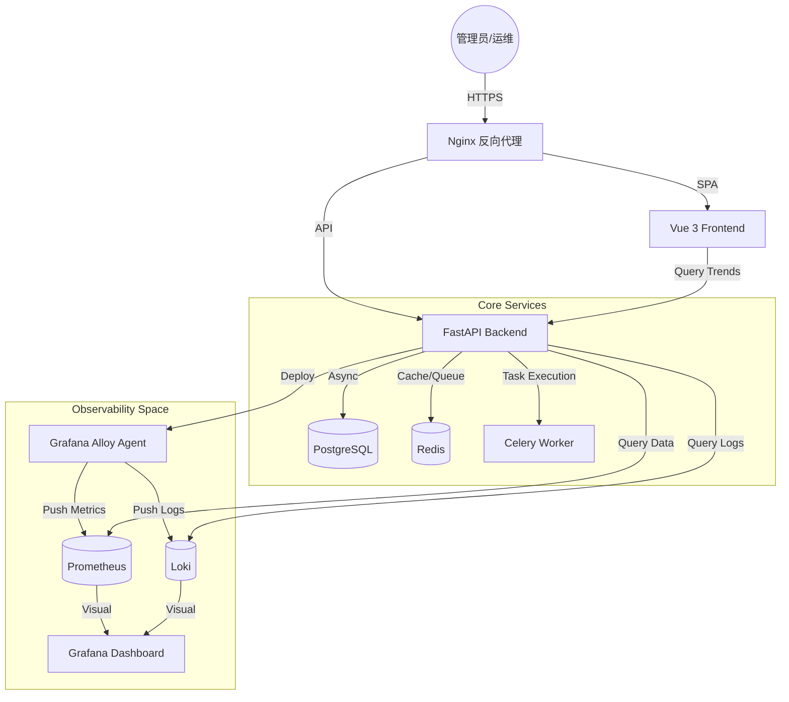

# 运维平台 (Operations Platform)

现代化的企业级运维管理平台,提供资源管理、监控告警、自动化运维等核心功能。

## 核心理念 (Core Philosophy)

*   **简洁至上**：恪守KISS原则，关注核心运维价值，拒绝臃肿。
*   **极致视觉**：基于现代化暗黑美学设计，提供沉浸式的指挥中心体验。
*   **即插即用**：通过一键部署 Agent (Alloy)，分钟级完成监控接入。

## 架构概览 (Architecture)



## 技术栈

### 后端
- **FastAPI** - 高性能异步 Web 框架
- **PostgreSQL** - 关系型数据库
- **Redis** - 缓存、Celery 代理及消息队列
- **Celery** - 分布式异步任务队列及定时调度
- **SQLAlchemy** - 异步 ORM 支持
- **Prometheus** - 监控指标存储与查询
- **Grafana Loki** - 日志聚合与检索中心

### 前端
- **Vue 3** - 组合式 API 开发
- **TypeScript** - 严谨的类型系统
- **Element Plus** - 深度定制的暗黑视觉组件库
- **Vite** - 极速构建与开发体验
- **ECharts** - 动态性能趋势图
- **Pinia** - 响应式状态管理

### 基础设施
- **Docker & Docker Compose** - 容器化部署与编排
- **Nginx** - 静态资源分发与高性能反向代理
- **Grafana Alloy** - 下一代集成监控/日志采集 Agent
- **Grafana** - 专业的数据可视化面板

## 快速开始

### 前置要求
- Docker 20.10+
- Docker Compose 2.0+
- Node.js 18+ (仅用于本地开发)
- Python 3.11+ (仅用于本地开发)

### 使用 Docker Compose 启动 (推荐)

```bash
# 克隆项目
git clone <repository-url>
cd ops-platform

# 启动所有服务
docker-compose up -d

# 查看服务状态
docker-compose ps

# 查看日志
docker-compose logs -f
```

服务访问地址:
- **控制台 (Frontend)**: http://localhost
- **后端接口 (API)**: http://localhost:8000
- **交互文档 (Swagger)**: http://localhost:8000/api/docs
- **时间序列 (Prometheus)**: http://localhost/prometheus
- **数据可视化 (Grafana)**: http://localhost:3000 (admin/admin)

## 系统配置 (.env)

| 变量名 | 描述 | 默认值/示例 |
| :--- | :--- | :--- |
| `EXTERNAL_API_URL` | 后端对外的基础 URL (用于 Agent 回传) | `http://<SSH_IP>:8000` |
| `LOKI_URL` | 内部 Loki 地址 | `http://loki:3100` |
| `LOKI_EXTERNAL_URL` | Agent 可达的外部 Loki 地址 | `http://<NGINX_IP>:3100` |
| `CORS_ORIGINS` | 跨域允许列表 (逗号分隔) | `http://localhost:5173,...` |
| `POSTGRES_DB` | 数据库名称 | `ops_platform` |
| `DEBUG` | 调试模式 (显示详细报错栈) | `false` |

### 本地开发

#### 后端开发

```bash
cd backend

# 创建虚拟环境
python -m venv venv
source venv/bin/activate  # Windows: venv\Scripts\activate

# 安装依赖
pip install -r requirements.txt

# 启动数据库 (使用 Docker)
docker-compose up -d postgres redis

# 运行开发服务器
uvicorn app.main:app --reload --host 0.0.0.0 --port 8000
```

#### 前端开发

```bash
cd frontend

# 安装依赖
npm install

# 启动开发服务器
npm run dev
```

## 项目结构

```
ops-platform/
├── backend/              # 后端服务
│   ├── app/
│   │   ├── api/         # API 路由
│   │   ├── core/        # 核心配置
│   │   ├── models/      # 数据模型
│   │   ├── schemas/     # Pydantic 模式
│   │   ├── services/    # 业务逻辑
│   │   └── tasks/       # Celery 任务
│   └── requirements.txt
├── frontend/            # 前端应用
│   ├── src/
│   │   ├── api/        # API 调用
│   │   ├── components/ # 组件
│   │   ├── layouts/    # 布局
│   │   ├── router/     # 路由
│   │   ├── stores/     # 状态管理
│   │   └── views/      # 页面
│   └── package.json
├── docker/             # Dockerfile 及服务配置 (Nginx/Loki/Prometheus)
├── monitoring/         # 监控配置文件 (Alert Rules)
├── templates/          # 自动化部署脚本模板 (Alloy/Promtail)
└── docker-compose.yml  # 容器编排主文件
```

## 设计美学 (Design Aesthetics)

项目深度集成了现代 Web 设计规范，打造“指挥中心”级别的视觉体验：
*   **玻璃拟态 (Glassmorphism)**：大量应用背景模糊与半透明层级，提升空间感。
*   **动态背光 (Ambient Light)**：登录页及 Dashboard 带有呼吸感的环境光效。
*   **Fira Code 字体**：针对运维场景优化的等宽字体显示。
*   **微交互驱动**：所有按钮及卡片均具有平滑的状态转换动画。

## 核心功能

### 1. 用户与权限管理
- ✅ 用户注册/登录
- ✅ JWT 认证
- ✅ 基于角色的访问控制 (RBAC)
- ✅ 操作审计日志

### 2. 资源管理 (CMDB)
- ✅ 多环境资源接入 (物理机/虚拟机/容器/云主机)
- ✅ 资源生命周期管理
- ✅ 资源标签化管理
- ✅ 资源使用率监控

### 3. 监控告警
- ✅ 多维度监控指标 (CPU/内存/磁盘)
- ✅ Prometheus 集成
- ✅ 自定义告警规则
- ✅ 多渠道告警通知
- ✅ 告警历史管理

### 4. 自动化运维
- ✅ 脚本仓库管理 (Shell/Python/Ansible)
- ✅ 远程任务异步分发与执行
- ✅ 任务执行日志实时追踪
- ✅ 定时维护任务调度

### 5. 日志与故障排查
- ✅ 基于 Loki 的日志集中采集
- ✅ 自动化 Agent (Alloy) 一键部署
- ✅ 日志关键词快速搜索与聚合分析
- ✅ 故障定位时间轴视图

## 默认账号

首次启动后,需要创建管理员账号:

```bash
# 进入后端容器
docker-compose exec backend bash

# 创建管理员用户 (通过 API)
curl -X POST http://localhost:8000/api/v1/auth/register \
  -H "Content-Type: application/json" \
  -d '{
    "username": "admin",
    "email": "admin@example.com",
    "password": "admin123",
    "role": "admin"
  }'
```

登录信息:
- 用户名: admin
- 密码: admin123

## API 文档

启动服务后访问:
- Swagger UI: http://localhost:8000/api/docs
- ReDoc: http://localhost:8000/api/redoc

## 监控

### Prometheus 指标
访问 http://localhost/prometheus (生产) 或查看后端 `/metrics`。

项目采用 **Grafana Alloy** 作为唯一数据采集端,支持一键部署到目标服务器,自动采集以下核心指标:
- `node_cpu_seconds_total` - CPU 利用率(按核心/状态)
- `node_memory_MemTotal_bytes` - 内存使用详情
- `node_network_receive_bytes_total` - 实时带宽流量
- `node_filesystem_size_bytes` - 磁盘分区占用

### 日志中心 (Loki)
通过前台“日志中心”直接查询所有接入主机的 `/var/log/*.log` 系统日志。

### 可视化面板 (Grafana)
访问 http://localhost:3000 (admin/admin),内置了预设的 Redis、MySQL 及服务器性能大屏。

## 开发指南

### 添加新的 API 端点

1. 在 `backend/app/models/` 创建数据模型
2. 在 `backend/app/schemas/` 创建 Pydantic 模式
3. 在 `backend/app/api/v1/` 创建路由
4. 在 `backend/app/main.py` 注册路由

### 添加新的前端页面

1. 在 `frontend/src/views/` 创建 Vue 组件
2. 在 `frontend/src/router/index.ts` 添加路由
3. 在 `frontend/src/api/` 添加 API 调用方法

## 常见问题

### 1. 数据库连接失败

```bash
# 检查 PostgreSQL 状态
docker-compose logs postgres

# 重启数据库
docker-compose restart postgres
```

### 2. 前端无法访问后端

检查 `frontend/vite.config.ts` 中的代理配置

### 3. Celery 任务不执行

```bash
# 检查 Celery Worker 状态
docker-compose logs celery-worker

# 重启 Worker
docker-compose restart celery-worker
```

## 贡献

欢迎提交 Issue 和 Pull Request!

## 许可证

MIT License

## 联系方式

- 项目主页: <repository-url>
- 问题反馈: <repository-url>/issues